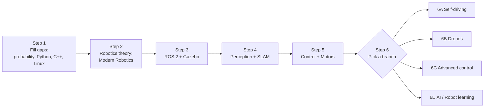

# 🤖 Robotics Roadmap for CS Graduates (100% Free Resources)

A step-by-step learning path for someone with a **BSCS degree** who knows programming basics, algebra, linear algebra and calculus, and wants to get into **robotics**: manipulators (robot arms), mobile robots, **self-driving cars** (the "Tesla" side), **electric motor control**, **drones**, and **AI-based robot learning**.

> **How to use this file:** Go in order from Step 1 to Step 5. After Step 5, pick **one** branch from Step 6 at a time. Tick the checkboxes (`- [ ]` → `- [x]`) as you finish things, and commit your progress to GitHub.

---

## 📑 Table of Contentss

1. [The Big Picture](#-the-big-picture)
2. [Step 1: Fill the Small Gaps](#step-1-fill-the-small-gaps-2-4-weeks)
3. [Step 2: Core Robotics Theory](#step-2-core-robotics-theory-about-3-months)
4. [Step 3: Robot Software (ROS 2 + Simulation)](#step-3-robot-software-ros-2--simulation-1-2-months)
5. [Step 4: Perception and SLAM](#step-4-perception-and-slam-2-3-months)
6. [Step 5: Control and Motors (Hardware Side)](#step-5-control-and-motors-hardware-side-1-2-months)
7. [Step 6: Choose Your Branch](#step-6-choose-your-branch)
   - [6A. Self-Driving Cars](#6a-self-driving-cars-the-tesla-branch)
   - [6B. Drones](#6b-drones)
   - [6C. Advanced Control (Legged and Flying Robots)](#6c-advanced-control-legged-and-flying-robots)
   - [6D. AI and Robot Learning](#6d-ai-and-robot-learning)
8. [Project Ideas](#-project-ideas-one-per-step)
9. [Glossary](#-glossary-small-definitions)
10. [Community and Extra Lists](#-community-and-extra-lists)
11. [Notes](#-notes)

---

## 🗺️ The Big Picture

**Total time:** roughly **9-12 months** at 8-10 hours per week to reach Step 6. *(This is an estimate, not an official figure. Go at your own speed.)*

### Is a Tesla a robot?
Yes. A self-driving car is a **mobile robot**: it senses the world (cameras, radar), decides what to do (planning), and acts (steering, motors). Two different skills are involved:

| Skill | What it is | Where you learn it |
|---|---|---|
| **Autonomy** (self-driving) | Perception, localization, planning | Steps 2, 3, 4 and branch 6A |
| **Electric motor control** | Making motors spin precisely (field-oriented control) | Step 5 |

---

## Step 1: Fill the Small Gaps (2-4 weeks)

**Goal:** Cover what your degree may not have covered. Robotics needs **probability** (sensors are noisy), **3D rotations**, and comfort with **Linux + Python + C++**.

**Who this is for:** Everyone. Skip any part you already know well.

### 1.1 Linear algebra refresher (optional, 1 week)

You already know the basics. Watch these to build *visual intuition*, which helps later with rotations and transformations.

- [ ] **Essence of Linear Algebra** by 3Blue1Brown, a visual playlist (free)
  🔗 https://www.youtube.com/playlist?list=PLZHQObOWTQDPD3MizzM2xVFitgF8hE_ab
- [ ] **Linear Algebra** by MIT OpenCourseWare, a full university course (free)
  🔗 https://www.youtube.com/playlist?list=PLE7DDD91010BC51F8

*Both are suggested by Prof. Cyrill Stachniss for his robotics course.*

### 1.2 Probability (2 weeks) ⭐ most important gap

**Why:** Robots never know their exact position. They estimate it using probability.

- [ ] **Probability Primer for Probabilistic Robotics** by Cyrill Stachniss (University of Bonn), free lecture
  🔗 https://www.ipb.uni-bonn.de/online-training-robotics/
  *(Look for "Probability Primer" in the Basics block.)*
- [ ] **Statistics and Probability** on Khan Academy, if you want a slower, gentler start (free)
  🔗 https://www.khanacademy.org/math/statistics-probability

### 1.3 3D rotations (3-4 days)

**Why:** Every robot arm, drone and car needs rotations in 3D (rotation matrices, Euler angles, quaternions).

- [ ] **Quaternions and 3D rotation, explained interactively** by 3Blue1Brown and Ben Eater (free)
  🔗 https://eater.net/quaternions
- [ ] **3D Coordinates and Representations of Rotations** by Cyrill Stachniss (same page as above)
  🔗 https://www.ipb.uni-bonn.de/online-training-robotics/

### 1.4 Programming setup

- [ ] Install **Ubuntu Linux** (dual-boot or virtual machine). Robotics software runs best on Ubuntu.
- [ ] Practice **Python** (NumPy, Matplotlib). Official tutorial: 🔗 https://docs.python.org/3/tutorial/
- [ ] Learn **basic C++**. Stachniss offers a free course, **Modern C++ for Computer Vision**. Find its playlist here: 🔗 https://www.ipb.uni-bonn.de/teaching/
- [ ] Learn basic **Git and GitHub** (you're already here, so commit your progress!)

---

## Step 2: Core Robotics Theory (about 3 months)

**Goal:** Understand how robots move mathematically: position, rotation, speed, force, planning and control.

**Who this is for:** Anyone with basic linear algebra, physics and ODEs. It's written for undergraduates (freshman-level background), so it suits you well.

### 📘 Main resource: *Modern Robotics: Mechanics, Planning, and Control*

| | |
|---|---|
| **Authors** | Kevin M. Lynch (Northwestern University) and Frank C. Park (Seoul National University) |
| **Published by** | Cambridge University Press, 2017 |
| **Cost** | Free preprint PDF, free video lessons and free software; the printed book is paid |
| **Level** | Beginner to intermediate |
| **Time** | About 3 months at 8-10 hours per week |

- 🔗 **Book, videos and software (free):** https://hades.mech.northwestern.edu/index.php/LynchAndPark
- 🔗 **Coursera specialization:** https://www.coursera.org/specializations/modernrobotics
  *Six four-week courses plus a capstone project on mobile manipulation. Check Coursera for free "audit" access; availability can change.*

#### Chapter-by-chapter map

| Topic | What you'll learn (in simple words) |
|---|---|
| **Configuration space** | How to describe every possible pose of a robot |
| **Rigid-body motions** | Rotation matrices and transformation matrices: moving objects in 3D |
| **Forward kinematics** | Given joint angles, where is the robot hand? |
| **Velocity kinematics** | Given joint speeds, how fast does the hand move? (the Jacobian) |
| **Inverse kinematics** | Given a target hand position, what joint angles are needed? |
| **Dynamics** | Forces and torques needed to move the robot |
| **Motion planning** | Finding a path that avoids obstacles |
| **Robot control** | Making the robot follow the path accurately |
| **Wheeled mobile robots** | How cars and rolling robots move and are controlled |

- [ ] Finish rigid-body motions and forward kinematics
- [ ] Finish velocity and inverse kinematics
- [ ] Finish dynamics
- [ ] Finish motion planning and control
- [ ] Finish wheeled mobile robots
- [ ] Do the exercises using the free companion software (Python/MATLAB/Mathematica)

**Extra (optional):** *Control Systems Lectures* by Brian Douglas on YouTube is a popular, friendly explanation of PID and feedback control (search the channel name).

---

## Step 3: Robot Software (ROS 2 + Simulation) (1-2 months)

**Goal:** Learn the software framework that most robots run on, and practice **without buying any hardware**.

**Who this is for:** Programmers. Requires basic Python or C++ and Linux (from Step 1).

### Key definitions

- **ROS 2 (Robot Operating System 2):** Not a real operating system. It's a free framework that lets different robot programs (camera, motors, planner) talk to each other using *topics*, *services* and *actions*.
- **Gazebo:** A free 3D simulator where you can test robots virtually.
- **RViz:** A tool that visualizes what the robot "sees" and "thinks".

### Resources

- [ ] **ROS 2 Official Documentation & Tutorials** (free, by Open Robotics / ROS community)
  🔗 https://docs.ros.org
  *Install the currently recommended LTS distribution for your Ubuntu version, then do "Beginner: CLI tools" and "Beginner: Client libraries".*
- [ ] **Gazebo Simulator** (free)
  🔗 https://gazebosim.org
- [ ] **Nav2 (Navigation 2) Documentation**: the standard ROS 2 navigation stack. Its quickstart has you navigate a simulated **TurtleBot 3** robot in Gazebo.
  🔗 https://docs.nav2.org
  🔗 Quickstart: https://docs.nav2.org/lyrical/getting_started/quickstart/quickstart/
  *(If this link changes, open docs.nav2.org and search "Quickstart".)*

### Checklist

- [ ] Install ROS 2 and run the "turtlesim" demo
- [ ] Write a Python publisher and subscriber node
- [ ] Run a TurtleBot 3 in Gazebo
- [ ] Make it navigate using Nav2

**Note:** There are paid Udemy courses on Nav2, but the official docs above are free and enough to start.

---

## Step 4: Perception and SLAM (2-3 months)

**Goal:** Learn how a robot understands its surroundings and knows where it is.

**Who this is for:** People who finished Steps 1-3. This is a must for self-driving and mobile robots.

### Key definitions

- **Perception:** Turning sensor data (camera, LiDAR, radar) into understanding.
- **Localization:** Answering "Where am I?"
- **Mapping:** Answering "What does the world look like?"
- **SLAM (Simultaneous Localization and Mapping):** Doing both at the same time when you have neither a map nor a known position.

### Resources

- [ ] **Mobile Sensing and Robotics** (course with video recordings) and **Robot Mapping** (SLAM course, videos on YouTube) by **Prof. Cyrill Stachniss**, University of Bonn (free)
  🔗 Teaching page with all courses: https://www.ipb.uni-bonn.de/teaching/
  🔗 Online basics block: https://www.ipb.uni-bonn.de/online-training-robotics/
  🔗 About the professor: https://www.ipb.uni-bonn.de/people/cyrill-stachniss/
- [ ] **"5 Minutes with Cyrill"**, a short-video series explaining robotics and computer vision concepts (e.g., SLAM, least squares) in 5 minutes each. Find it on the professor's YouTube channel, or via the links above.
- [ ] **SLAM for Beginners: the Basics** by MRPT, a curated list of gentle intro videos, papers and books (free)
  🔗 https://docs.mrpt.org/reference/2.4.9/tutorial-slam-for-beginners-the-basics.html
- [ ] **OpenCV** for practical computer vision in Python (free)
  🔗 https://opencv.org

### Checklist

- [ ] Understand least squares
- [ ] Understand Kalman/particle filters (probabilistic localization)
- [ ] Watch the SLAM introduction
- [ ] Run a SLAM package in ROS 2 simulation (e.g., `slam_toolbox` with Nav2)
- [ ] Do a small computer-vision task with OpenCV (detect lane lines or objects)

---

## Step 5: Control and Motors (Hardware Side) (1-2 months)

**Goal:** Learn how to make real motors move precisely. This is also your path toward understanding **Tesla/EV-style motors**.

**Who this is for:** Anyone who wants hands-on hardware work. Requires a low-cost kit (Arduino or ESP32, motor driver, motor). If you don't want to buy hardware yet, you can read the theory first.

### Key definitions

- **Actuator:** A part that creates motion (motor, servo, etc.).
- **PID controller:** A simple, widely used feedback method: Proportional (how far off), Integral (how long off), Derivative (how fast it's changing).
- **BLDC motor:** Brushless DC motor. Efficient and common in drones, robots and EVs.
- **FOC (Field-Oriented Control):** An advanced method for smooth, precise, efficient control of brushless motors. Similar principles are used in electric vehicles.

### Resources

- [ ] **Arduino Documentation & Tutorials** (free)
  🔗 https://docs.arduino.cc
- [ ] **SimpleFOC**: an open-source Arduino library and documentation designed to make FOC simple to learn for BLDC and stepper motors (free)
  🔗 https://simplefoc.com
  🔗 https://github.com/simplefoc/Arduino-FOC
- [ ] **PythonRobotics**: free Python code samples of robotics algorithms (localization, path planning, control, SLAM). Great for learning by reading and running code.
  🔗 https://github.com/AtsushiSakai/PythonRobotics

### Checklist

- [ ] Control a DC motor with an encoder using PID
- [ ] Understand how a brushless motor works
- [ ] Run a BLDC motor with SimpleFOC
- [ ] Read one PythonRobotics example (e.g., path tracking) and modify it

---

## Step 6: Choose Your Branch

Do **one branch at a time**. All of them build on Steps 1-5.

### 6A. Self-Driving Cars (the "Tesla" branch)

**What it is:** Building the software stack that lets a car sense, plan and drive by itself.

**Who this is for:** Anyone who finished Steps 2-4. Best for people interested in autonomous vehicles, perception and planning.

- [ ] **Self-Driving Cars Specialization**, University of Toronto (Coursera). Four courses:
  1. Introduction to Self-Driving Cars
  2. State Estimation and Localization
  3. Visual Perception for Self-Driving Cars
  4. Motion Planning for Self-Driving Cars

  It uses the open-source **CARLA** simulator, so you can drive a virtual car around a racetrack. Designed for learners with some engineering experience. Check Coursera for audit/free access.
  🔗 https://www.coursera.org/specializations/self-driving-cars
  🔗 Course 1: https://www.coursera.org/learn/intro-self-driving-cars
- [ ] **CARLA Simulator**, an open-source simulator for autonomous driving research (free)
  🔗 https://carla.org
- [ ] **openpilot** (comma.ai), an open-source driver-assistance system that upgrades supported cars. It's a steeper, advanced project, so try it later.
  🔗 https://github.com/commaai/openpilot
- [ ] **Autoware**, an open-source autonomous driving software project (advanced)
  🔗 https://github.com/autowarefoundation/autoware

---

### 6B. Drones

**What it is:** Building and programming flying robots (multicopters, planes).

**Who this is for:** People who like hardware and flight control. You need a compatible drone or flight controller for real flight; simulation works without one.

- [ ] **PX4 Autopilot User Guide**: open-source flight-control software. Start with **Basic Concepts**, which explains what a drone is and what the parts do (flight controller, ESCs, motors, battery).
  🔗 https://docs.px4.io/v1.14/en/getting_started/px4_basic_concepts.html
  🔗 Main docs: https://docs.px4.io
- [ ] **QGroundControl**: the ground-control software used with PX4 to set up the vehicle, view flight data and plan autonomous missions (free)
  🔗 http://qgroundcontrol.com
- [ ] PX4 works with **ROS 2** and **MAVSDK** for companion computers, which is a nice link back to Step 3.

**Definitions:** *Flight controller* = the drone's brain. *ESC* = electronic speed controller that drives each motor. *Pixhawk* = a popular open flight-controller hardware standard.

---

### 6C. Advanced Control (Legged and Flying Robots)

**What it is:** Nonlinear dynamics and optimal control for robots that walk, run, swim and fly.

**Who this is for:** Strong-math learners who finished Step 2. It is **graduate level** and harder than the rest.

- [ ] **Underactuated Robotics** by Prof. Russ Tedrake (MIT). Free lecture notes/course site with a computational focus (walking, running, flying, manipulation).
  🔗 https://underactuated.csail.mit.edu/
  🔗 Older MIT OpenCourseWare version (lecture videos and transcripts): https://ocw.mit.edu/courses/6-832-underactuated-robotics-spring-2009/

**Definition:** *Underactuated* = the robot has fewer motors than movements it wants to control (like a walking robot that can fall).

---

### 6D. AI and Robot Learning

**What it is:** Teaching robots using data and machine learning instead of hand-written rules.

**Who this is for:** People comfortable with Python and PyTorch who want to combine AI with robots. **You can start with only a browser** (Google Colab).

- [ ] **Hugging Face Robotics Course**: a free course going from classical robotics to learning-based approaches, using the LeRobot library
  🔗 https://huggingface.co/learn/robotics-course/en/unit0/1
- [ ] **Robot Learning Tutorial** (the guide this course is based on)
  🔗 https://huggingface.co/spaces/lerobot/robot-learning-tutorial
- [ ] **LeRobot** (open-source library by Hugging Face, built on PyTorch). It supports affordable, 3D-printable arms such as SO-100/SO-101 and the ALOHA bimanual setup.
  🔗 https://github.com/huggingface/lerobot

**Definition:** *Imitation learning* = a robot learns a task by watching examples from a human.

---

## 🛠️ Project Ideas (One per Step)

| After Step | Project | Hardware needed? |
|---|---|---|
| 1 | Plot 3D rotations with NumPy and Matplotlib | No |
| 2 | Write forward and inverse kinematics for a 2-link or 6-link arm in Python | No |
| 3 | Make a simulated TurtleBot 3 navigate a room with Nav2 | No |
| 4 | Build a map with SLAM in simulation; detect lane lines with OpenCV | No |
| 5 | PID speed control of a motor; then a BLDC motor with SimpleFOC | Yes (cheap) |
| 6A | Drive a car around a track in CARLA using your own controller | No |
| 6B | Fly a simulated drone using PX4 and QGroundControl | No (for simulation) |
| 6D | Train a simple policy with LeRobot in Google Colab | No |

> 💡 **Tip:** Put each project in its own GitHub repository with a good README. This becomes your portfolio.

---

## 📖 Glossary (Small Definitions)

| Term | Simple meaning |
|---|---|
| **Kinematics** | Motion without thinking about forces (positions and speeds of robot parts) |
| **Dynamics** | Motion including forces and torques |
| **Forward kinematics** | Joint angles → hand position |
| **Inverse kinematics** | Desired hand position → joint angles |
| **Jacobian** | A matrix linking joint speeds to hand speed |
| **Configuration space (C-space)** | The set of all possible poses of a robot |
| **Degrees of freedom (DoF)** | Number of independent ways a robot can move |
| **Trajectory** | A path plus timing (how fast to follow it) |
| **Odometry** | Estimating position by counting wheel turns or motion |
| **LiDAR** | A laser sensor that measures distance to build a 3D/2D picture |
| **Sensor fusion** | Combining several sensors (e.g., camera + IMU) for a better estimate |
| **IMU** | Sensor measuring acceleration and rotation |
| **Kalman filter** | A math method to estimate the true state from noisy sensors |
| **SLAM** | Building a map and locating yourself in it simultaneously |
| **PID** | Simple feedback controller (P, I, D terms) |
| **FOC** | Precise control of brushless motors |
| **ROS 2** | Framework for building robot software |
| **URDF** | A file format that describes a robot's body (links and joints) for ROS |
| **Simulation** | Testing a robot virtually before using hardware |
| **Reinforcement learning** | Learning by trial and reward |
| **Imitation learning** | Learning by copying demonstrations |

---

## 🌐 Community and Extra Lists

- **Awesome Mobile Robotics**: a GitHub list of courses and links on robotics and computer vision
  🔗 https://github.com/mathiasmantelli/awesome-mobile-robotics
- **LeRobot Discord** (linked from the LeRobot GitHub page) for questions on robot learning
- **ROS Discourse and ROS Answers** for ROS 2 questions (search "ROS Discourse")
- **PX4 Discord / forum** (linked from the PX4 docs) for drone questions

---

## 📝 Notes

- Time estimates are **approximate** and depend on your pace.
- Links were checked at the time of writing (September 2026). Websites change, so if one breaks, search the resource name.
- Some courses (e.g., on Coursera) may require payment for certificates or graded work. The **books, lectures, docs and open-source tools** listed are free.
- Learning tip: after every video or chapter, **write code** or **run a simulation**. Practice matters more than watching.

---

⭐ If this roadmap helps you, star the repo and track your progress by ticking the boxes above.
